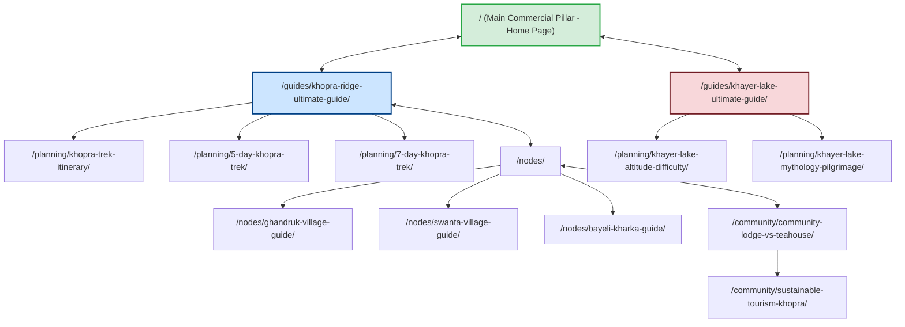
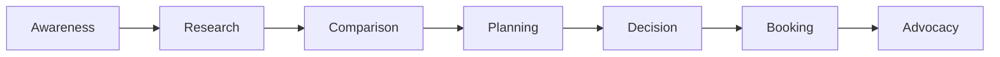
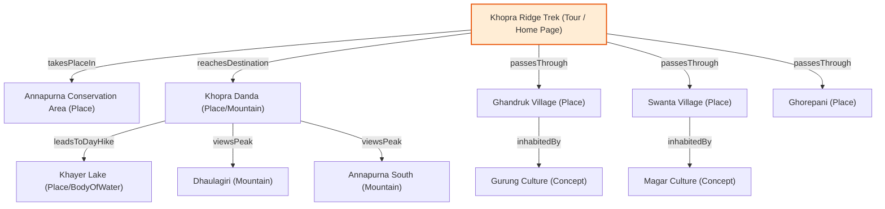

# Khopra Ridge Trek — Complete Topical Authority Website Strategy & Execution Blueprint

This blueprint outlines the complete information architecture, silo structures, entity SEO mapping, user journeys, content plan, AI search optimization, and conversion layout for building the definitive authority website on the **Khopra Ridge Trek**.

---

## Task 1: Website Information Architecture

To capture organic search traffic and establish topical authority, we structure the website into clear directory hierarchies matching distinct search intents.

### 1.1 Commercial Money Pages
These pages are optimized for transactional and commercial investigation search terms. They are designed to drive direct booking inquiries. Since we own the Exact Match Domain (EMD) **khopraridgetrek.com**, the **homepage (`/`)** serves as the primary commercial money page.

| Page Name | URL Path | Search Intent | Funnel Stage | Primary Conversion Goal | Internal Linking Focus |
| :--- | :--- | :--- | :--- | :--- | :--- |
| **9-Day Khopra Ridge Trek (Core Product)** | `/` (Homepage) | Transactional | Bottom (Decision) | Direct Inquiry / Booking Form | Links to all node guides, packing checklist, and permit pages. Recieves links from all informational posts. |
| **Khayer Lake Pilgrimage Trek** | `/tours/khayer-lake-trek/` | Transactional | Bottom (Decision) | Direct Inquiry / Booking Form | Links to `/guides/khayer-lake-ultimate-guide/`. |
| **Khopra Ridge + Poon Hill Combo Trek** | `/tours/khopra-poon-hill-trek/` | Transactional | Bottom (Decision) | Direct Inquiry / Booking Form | Cross-links with `/guides/khopra-vs-poon-hill/` and Poon Hill pages. |
| **Khopra + Mohare Danda Offbeat Trek** | `/tours/khopra-mohare-danda-trek/`| Transactional | Bottom (Decision) | Direct Inquiry / Booking Form | Links to `/guides/mohare-danda/` and community lodge guides. |

---

### 1.2 Informational Supporting Pages
Supporting articles build topical authority by covering the entire informational search landscape.

| Directory / Category | URL Path | Content Type | Primary Entity | Supporting Entities |
| :--- | :--- | :--- | :--- | :--- |
| **Core Guides** | `/guides/khopra-ridge-ultimate-guide/` | Pillar Article | Khopra Ridge | Khayer Lake, Annapurna Conservation Area |
| **Core Guides** | `/guides/khayer-lake-ultimate-guide/` | Pillar Article | Khayer Lake | Khair Lake Pilgrimage, Annapurna South |
| **Route Node** | `/nodes/ghandruk-village-guide/` | Location Hub | Ghandruk Village | Gurung Culture, Kimche, Nayapul |
| **Route Node** | `/nodes/tadapani-guide/` | Location Hub | Tadapani | Tadapani Weather, Tadapani Lodging |
| **Route Node** | `/nodes/bayeli-kharka-guide/` | Location Hub | Bayeli Kharka | Bayeli Kharka Lodges, Annapurna South Views |
| **Route Node** | `/nodes/chhistibung-guide/` | Location Hub | Chhistibung | Wildlife, Langurs, Chhistibung Lodges |
| **Route Node** | `/nodes/swanta-village-guide/` | Location Hub | Swanta Village | Magar Culture, Swanta Lodging |
| **Route Node** | `/nodes/ghorepani-guide/` | Location Hub | Ghorepani | Poon Hill, Ghorepani Teahouses |
| **Viewpoints** | `/viewpoints/muldai-viewpoint-guide/` | Viewpoint Pillar | Muldai Hill | Sunrise Views, Dhaulagiri, Annapurna South |
| **Viewpoints** | `/viewpoints/khopra-vs-poon-hill-views/`| Comparison | Khopra Ridge | Poon Hill, View Quality, Crowds |
| **Mountains** | `/mountains/dhaulagiri-views-khopra/` | Mountain Focus | Dhaulagiri | Khopra Danda, Hiunchuli, Nilgiri |
| **Biodiversity** | `/ecology/wildlife-khopra-trek/` | Flora/Fauna | Himalayan Monal | Annapurna Conservation Area, Langur, Musk Deer |
| **Biodiversity** | `/ecology/rhododendron-forests/` | Flora/Fauna | Rhododendron | Spring Bloom, Ghandruk, Tadapani |
| **Community** | `/community/what-is-community-lodge/` | Concept Hub | Community Lodges | Sustainable Tourism, Swanta Village, Magar |
| **Logistics** | `/planning/khopra-trek-cost/` | Cost Hub | Trek Cost | Guide Fees, Permit Fees, Lodge Pricing |
| **Logistics** | `/planning/khopra-trek-permits/` | Permit Hub | TIMS Card | ACAP Permit, Nepal Regulations |

---

### 1.3 Programmatic Pages
These pages dynamically aggregate structured datasets to target high-intent long-tail keywords.

* **Trek Altitude Profile Pages** (e.g., `/altitude/khopra-ridge-elevation/`):
  - *Template Structure*: Interactive elevation charts, oxygen level calculators, acclimatization advice.
  - *Dynamic Fields*: Target altitude, gain-per-day, slope grade, village elevation list.
* **Village-to-Village Route Pages** (e.g., `/routes/ghandruk-to-tadapani/`):
  - *Template Structure*: Distance tables, terrain difficulty metrics, teahouse density indices, GPS trail files.
  - *Dynamic Fields*: Origin, Destination, Walking Time, Ascent, Descent, Trail Conditions.
* **Monthly Weather & Packing Guides** (e.g., `/weather/khopra-trek-october/`):
  - *Template Structure*: Average temperature charts, rainfall statistics, seasonal gear checklists, trail visibility reports.
  - *Dynamic Fields*: Month, Average High/Low temp, Rain days, Recommended gear layer checklist.

---

## Task 2: Silo Architecture & Topic Clusters

We arrange content into strict physical and virtual silos to concentrate page authority and pass contextual value cleanly.



---

## Task 3: User Journey Mapping

We map our content across the seven phases of the buyer's cycle to capture searchers at every point of intent.



### Stage-by-Stage Content Playbook

1. **Awareness (Inspirational/Discovery)**:
   - *User Questions*: What is a less crowded trek in Nepal that still offers great Annapurna views?
   - *Key Assets*: Virtual tours, high-definition mountain panorama image galleries, comparison tables.
   - *Required Pages*: `/guides/why-khopra-is-less-crowded/`, `/viewpoints/best-offbeat-trek-nepal/`.

2. **Research (Informational)**:
   - *User Questions*: How hard is the trek to Khopra Danda? Can beginners do it? What is the altitude profile?
   - *Key Assets*: Interactive elevation map, daily trekking time estimations.
   - *Required Pages*: `/guides/khopra-ridge-ultimate-guide/`, `/planning/khopra-trek-for-beginners/`.

3. **Comparison (Evaluation)**:
   - *User Questions*: Should I do Poon Hill, Mardi Himal, or Khopra Ridge? Which has better views?
   - *Key Assets*: Feature matrix comparing trail conditions, crowd density, and mountain proximity.
   - *Required Pages*: `/viewpoints/khopra-vs-poon-hill-views/`, `/guides/khopra-vs-mardi-himal/`.

4. **Trip Planning (Logistics)**:
   - *User Questions*: What permits do I need? Pokhara to Ghandruk transport options? How much does it cost?
   - *Key Assets*: Interactive packing checklist generator, permit cost calculator.
   - *Required Pages*: `/planning/khopra-trek-permits/`, `/planning/pokhara-to-ghandruk/`.

5. **Decision (Commercial)**:
   - *User Questions*: What makes this community trek operator different? What is included in the package?
   - *Key Assets*: Customer reviews, transparent pricing breakdown, guide biography sections.
   - *Required Pages*: `/` (Commercial Pillar / Homepage), `/community/what-is-community-lodge/`.

6. **Booking (Transactional)**:
   - *User Concerns*: Is my payment secure? What is the cancellation policy?
   - *Key Assets*: SSL trust badges, flexible date selection calendar, clear payment gateways.
   - *Required Pages*: `/checkout/`, `/booking-policies/`.

7. **Post-Trek Advocacy (Retention/Viral)**:
   - *User Behavior*: Sharing trip photos, writing reviews, planning the next trek.
   - *Key Assets*: Referral discounts, photographer showcase database.
   - *Required Pages*: `/community/photographer-showcase/`, `/review-submission/`.

---

## Task 4: Entity SEO Plan

AI search engines index topics by building relationships between structured semantic entities. The following map outlines the entity relationships designed for our site.

| Entity Type | Entity Name | Search Engine Relevance | Target Schema Type | Primary Entity Link |
| :--- | :--- | :--- | :--- | :--- |
| **Location** | **Annapurna Conservation Area** | The parent geography regulating the trek. | `Place` / `AdministrativeArea` | `/ecology/annapurna-conservation-area-guide/` |
| **Location** | **Khopra Ridge (Khopra Danda)** | The core destination ridge. | `Mountain` / `Place` | `/guides/khopra-ridge-ultimate-guide/` |
| **Location** | **Khayer Lake** | High-altitude holy lake. | `BodyOfWater` / `Place` | `/guides/khayer-lake-ultimate-guide/` |
| **Mountain** | **Dhaulagiri (8,167m)** | Main visible peak. | `Mountain` | `/mountains/dhaulagiri-views-khopra/` |
| **Concept** | **Community Tourism** | Social project supporting local Magar and Gurung villages. | `Thing` (Defined by Wikidata) | `/community/what-is-community-lodge/` |
| **Cuisine** | **Dal Bhat** | Crucial diet for Himalayan trekking energy. | `FoodEstablishment` / `MenuItem` | `/guides/local-food-on-khopra/` |

---

## Task 5: Knowledge Graph Design

This graph defines the exact relationships semantic search bots crawl to build context around our brand.



---

## Task 6: Content Production Plan & Publishing Roadmap

We organize content production into tiers based on commercial conversion potential, topical necessity, and link acquisition capability.

### 6.1 Content Tier Mapping

* **Tier 1 (High Priority - Foundation)**: Core commercial page and ultimate pillars.
* **Tier 2 (Medium Priority - Cluster Support)**: Location guides, comparison hubs, viewpoint articles.
* **Tier 3 (Lower Priority - Long-Tail Authority)**: Local wildlife guides, niche planning pages, storytelling.

| Priority | Page URL | Tier | Traffic Potential | Business Value | Link Attraction |
| :--- | :--- | :---: | :--- | :--- | :--- |
| **1** | `/` (Homepage) | Tier 1 | High | Critical | High |
| **2** | `/guides/khopra-ridge-ultimate-guide/` | Tier 1 | High | High | Very High |
| **3** | `/guides/khayer-lake-ultimate-guide/` | Tier 1 | Medium | High | High |
| **4** | `/viewpoints/khopra-vs-poon-hill-views/`| Tier 2 | High | High | Medium |
| **5** | `/planning/khopra-trek-cost/` | Tier 2 | High | Medium | Low |
| **6** | `/community/what-is-community-lodge/` | Tier 2 | Low | High | High |
| **7** | `/ecology/wildlife-khopra-trek/` | Tier 3 | Low | Low | Medium |

---

### 6.2 6-Month Content Roadmap

* **Month 1 (Core Silo Foundation)**:
  - Publish `/` (commercial homepage).
  - Publish `/guides/khopra-ridge-ultimate-guide/` (informational pillar).
  - Set up global JSON-LD schemas on the home page and core pages.
* **Month 2 (Destination Node Layer)**:
  - Publish village and logistics nodes: Ghandruk (`/nodes/ghandruk-village-guide/`), Swanta, Ghorepani.
  - Publish transport and logistics routes (Pokhara to Ghandruk).
* **Month 3 (Khayer Lake Hub)**:
  - Publish `/guides/khayer-lake-ultimate-guide/` and supporting guides for altitude, pilgrimage, and packing.
* **Month 4 (Visual & Comparison Layer)**:
  - Publish viewpoint guides, Muldai Hill (`/viewpoints/muldai-viewpoint-guide/`), and mountain view guides.
  - Publish comparative articles: Khopra vs Poon Hill, Mardi Himal, Annapurna Circuit.
* **Month 5 (Community & Ecology Context)**:
  - Publish community lodging, sustainability guides, conservation, and wildlife pages.
* **Month 6 (Persona & Long-Tail Optimization)**:
  - Publish traveler persona hubs (Beginners, Solo, Seniors).
  - Launch interactive calculators and maps.

---

## Task 7: AI Search Optimization (GEO)

To rank within AI answers (ChatGPT, Perplexity, Gemini), the site must serve clear, verifiable, entity-rich statements alongside experience signals.

```
       ┌────────────────────────────────────────────────────────┐
       │                AI SEARCH ENGINE CRITERIA               │
       └───────────────────────────┬────────────────────────────┘
                                   │
         ┌─────────────────────────┼─────────────────────────┐
         ▼                         ▼                         ▼
┌─────────────────┐       ┌─────────────────┐       ┌─────────────────┐
│EEAT DATA BLOCKS │       │CITABLE STATS    │       │Q&A SCHEMA BLOCKS│
│Original photos  │       │Altitudes,       │       │Answers directly │
│GPS files (.gpx) │       │Durations,       │       │answering long-  │
│Author credentials│      │Permit costs     │       │tail questions   │
└─────────────────┘       └─────────────────┘       └─────────────────┘
```

### Citability Score Matrix

| Target URL | Expected AI Query | Optimization Tactic | Citation Probability |
| :--- | :--- | :--- | :---: |
| `/` (Homepage) | "Best operators for Khopra Ridge Community Trek" | Original pricing structures, clear inclusion tables, guide certification details. | **High** |
| `/planning/khopra-trek-permits/` | "What permits do I need for Khopra Trek in 2026?" | Up-to-date fee lists, step-by-step application instructions, structured FAQ block. | **Very High** |
| `/guides/khayer-lake-ultimate-guide/` | "How to get to Khayer Lake from Khopra Danda" | GPX maps, distance graphs, specific landmark details, altitude-warning sections. | **High** |

---

## Task 8: Conversion Architecture

Conversion strategies must align with the user's intent to avoid early funnel exits.

```
       [ Informational Post ] ──> [ Exit Intent Pop-up: Free GPX Route Map ]
                │
                └──> (Sidebar CTA: "Download Complete 9-Day Itinerary PDF")
                          │
                          └──> [ Transactional Page: / (Homepage) ]
                                    │
                                    └──> [ Interactive Booking Engine / Inquiry Form ]
```

* **Lead Magnets**:
  - *Silo*: Route & Packing.
  - *Asset*: "Ultimate Khopra Ridge Trail Map & Altitude Profile Guide (Offline GPX Map included)".
* **Trust Signals**:
  - Direct integration of verified TripAdvisor and Google Reviews.
  - "Annapurna Conservation Area Approved Operator" badge.
  - Tour operator registration license details clearly visible in the footer.
* **CTAs**:
  - Floating sticky CTA on mobile: "Inquire Now".
  - Large button at the end of each daily itinerary: "Book This Trek".

---

## Task 9: Internal Linking Blueprint

Strict silo structure dictates that internal links must flow from supporting detail articles upward to node hubs, and then finally converge on the commercial landing page.

```
Source Page ───────────────────────────> Destination Page ─────────────────────> Anchor Text
/guides/khopra-ridge-ultimate-guide/    /                                       "book our 9-day Khopra Ridge Trek itinerary"
/viewpoints/muldai-viewpoint-guide/     /guides/khopra-ridge-ultimate-guide/    "Khopra Ridge hiking guide"
/planning/khopra-trek-permits/          /                                       "permit-inclusive Khopra Danda package"
/nodes/ghandruk-village-guide/          /                                       "start your trek through Ghandruk"
/guides/khayer-lake-ultimate-guide/     /tours/khayer-lake-trek/                "dedicated Khayer Lake trekking tour"
```

---

## Task 10: Topical Gap Analysis

Competitors routinely miss the following critical search angles. Adding these creates a significant competitive advantage.

1. **Local Legend & Cultural Context**:
   - *Topic*: Khayer Baraha Temple pilgrimage and local Magar folklore.
   - *Target keyword*: `Khayer Baraha Temple pilgrimage festival`.
2. **Transportation Infrastructure Details**:
   - *Topic*: Detailed transport schedules, costs, and reviews of Pokhara to Ghandruk transport.
   - *Target keyword*: `jeep cost Pokhara to Kimche`.
3. **Altitude Acclimatization Tools**:
   - *Topic*: Interactive tool displaying altitude profile relative to oxygen pressure percentage.
   - *Target keyword*: `Khopra Ridge altitude sickness guide`.

---

## Task 11: Authority Assets Roadmap

These elements are designed to attract backlinks naturally from forums, blogs, and news sites.

### 1.1 Live Elevation & Route Difficulty Calculator
- **Purpose**: Let users customize their route (e.g., adding Poon Hill or starting at Ghandruk) to view their dynamic daily altitude gains and difficulty score.
- **Backlink Potential**: Very High.
- **Priority**: High (Month 3).

### 1.2 Community Teahouse Availability Database
- **Purpose**: Provides contact numbers, average prices, room availability, and amenities for every lodge along the offbeat trail.
- **Backlink Potential**: High.
- **Priority**: Medium (Month 5).

### 1.3 Packing Checklist Generator
- **Purpose**: Dynamic checklist generator based on the month of the trek (monsoon vs winter) and trekking style (guided vs solo).
- **Backlink Potential**: Medium.
- **Priority**: Low (Month 6).

---

## Task 12: E-E-A-T Strategy

Search engines prioritize first-hand experience and verified expertise over generic content. We structure our E-E-A-T plan around verified sources.

```
  ┌────────────────────────────────────────────────────────┐
  │                    E-E-A-T EVIDENCE                    │
  └───────────────────────────┬────────────────────────────┘
                              │
    ┌─────────────────────────┼─────────────────────────┐
    ▼                         ▼                         ▼
┌───────────────┐        ┌───────────────┐        ┌───────────────┐
│LOCAL GUIDE    │        │GPX PATH DATA  │        │LIVE PHOTOGRAPHY│
│PROFILES       │        │Embed original │        │High-res photos │
│Bio, license #,│        │Garmin/Strava  │        │with EXIF metadata│
│years on trail │        │GPS tracks     │        │proving onsite  │
└───────────────┘        └───────────────┘        └───────────────┘
```

* **Content Review System**: Every informational page includes a "Reviewed by [Name of Local Guide]" section linking to their bio and certification badge.
* **Original Media**: Avoid stock images. All trail sections must show photos featuring our guides and clients.

---

## Task 13: Schema Strategy

We implement advanced JSON-LD structured data on all pages to ensure search engine spiders process our relationships correctly.

### 1.1 Tour / Itinerary Schema (for `/` - Homepage)
```json
{
  "@context": "https://schema.org",
  "@type": "TouristTrip",
  "name": "Khopra Ridge Community Trek",
  "description": "A 9-day community-owned trek in the Annapurna region reaching Khopra Ridge and the sacred Khayer Lake.",
  "touristType": "Backpacker",
  "itinerary": {
    "@type": "ItemList",
    "numberOfItems": 9,
    "itemListElement": [
      {
        "@type": "ListItem",
        "position": 1,
        "item": {
          "@type": "Place",
          "name": "Drive Pokhara to Ghandruk, trek to Tadapani"
        }
      },
      {
        "@type": "ListItem",
        "position": 2,
        "item": {
          "@type": "Place",
          "name": "Trek from Tadapani to Bayeli Kharka"
        }
      }
    ]
  }
}
```

### 1.2 TouristAttraction / Place Schema (for `/nodes/bayeli-kharka-guide/`)
```json
{
  "@context": "https://schema.org",
  "@type": "TouristAttraction",
  "name": "Bayeli Kharka",
  "description": "An essential route node and community lodge settlement on the Khopra Ridge Trek route.",
  "containedInPlace": {
    "@type": "Place",
    "name": "Annapurna Conservation Area"
  }
}
```

---

## Task 14: Final Implementation Checklists

```
[ ] Establish core site structure & configure folders
[ ] Deploy 9-day commercial page as the homepage (/)
[ ] Write village node articles
[ ] Set up interactive tools (cost & altitude calculators)
[ ] Embed schema templates
[ ] Audit internal links using the Source-to-Destination blueprint
```
